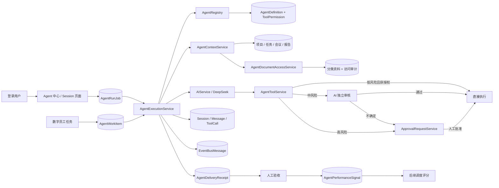

# 撒豆成兵 Agent 框架开发手册

> 适用范围：`ToDo` Razor 项目当前 Agent 框架（更新至 2026-08-31）
> 技术栈：.NET 8、ASP.NET Core Razor Pages、Entity Framework Core 8、MySQL、DeepSeek/OpenAI 兼容 Chat Completions 接口  
> 目标读者：接手 Agent、工具、审批、项目资料权限和 AI Session 开发的后端或全栈开发者

## 1. 先理解这里的“Agent 框架”

本项目的 Agent 不是写死的一次性 AI 提示词，也不是自动拥有数据库权限的机器人。它是下面几部分组成的受控执行框架：

1. `AgentDefinition` 保存 Agent 的身份、模型参数、系统提示词、上下文来源和发布生命周期。
2. `AgentContextService` 在当前用户权限范围内组装项目、任务、会议、资料和报告上下文。
3. `AgentExecutionService` 建立多轮 Session，调用模型并维护对话状态。
4. `AgentToolCatalog` 声明模型可以申请调用的工具。
5. `AgentToolPermission` 控制每个 Agent 实际启用哪些工具、是否需要审批。
6. `AgentToolService` 解析模型工具指令并做项目边界、资料权限等校验。
7. `ApprovalRequestService` 对敏感写入执行人工审批、事务和并发保护。
8. Session、消息、工具调用、资料访问日志和事件总线共同形成审计链路。
9. `AgentWorkQueueService` 将任务指派、人工评论和审核驳回转成持久化工作项，由后台服务自动执行、重试和续跑。
10. `AgentRunQueueService` 将 Agent 中心的手工运行和继续对话也持久化，浏览器关闭后仍可完成。
11. `AgentRiskPolicyService` 按低、中、高风险选择直接执行、AI 自动审核或人工审批；自动审核不确定时默认转人工。
12. `AgentAcceptanceContract` 把目标、输入、必需输出、成功标准和禁止行为固化为发布合同。
13. `AgentTestingService` 在关闭全部业务工具的隔离环境中验证当前版本，只允许按正式权限读取上下文。
14. `AgentTestRun` 保存测试输入、输出、自动校验结果和 Session 证据；通过后才开放发布门禁。
15. `AgentDeliveryReceipt` 将一次工作提交固化为结论、系统证据、脱敏工具影响、风险提示和完整性哈希。
16. `AgentOutcomeService` 将人工验收和派单选择写成幂等表现信号，供调度器后续评分使用。
17. `MeetingActionSupervisionService` 以正式任务为事实源，计算会议承诺状态、升级等级，并生成幂等督办事件和项目内通知。

核心原则是：**模型只负责提出内容或操作建议，系统代码负责授权、校验和最终执行。**



## 2. 代码地图

| 职责 | 主要文件 |
| --- | --- |
| Agent 定义实体 | `ToDo.Entities/AgentDefinition.cs` |
| Agent 配置版本快照 | `ToDo.Entities/AgentDefinitionVersion.cs` |
| Agent 生命周期、验收合同和隔离测试记录 | `ToDo.Entities/AgentProductization.cs` |
| Agent 正式交付和表现反馈实体 | `ToDo.Entities/AgentDelivery.cs` |
| 上下文和工具权限实体 | `ToDo.Entities/AgentConfiguration.cs` |
| Session、消息、工具调用、资料权限实体 | `ToDo.Entities/AiSession.cs`、`ToDo.Entities/AgentWorkflow.cs` |
| EF Core DbSet 与关系 | `ToDo.Context/ApplicationDbContext.cs` |
| Agent 注册表和内置 Agent | `ToDo.Domain/AgentRegistry.cs` |
| Agent 后台配置与校验 | `ToDo.Domain/AgentAdministrationService.cs` |
| Agent 创建模板 | `ToDo.Domain/AgentTemplateCatalog.cs` |
| Agent 隔离测试与发布门禁 | `ToDo.Domain/AgentTestingService.cs` |
| 交付凭证、验收与调度反馈 | `ToDo.Domain/AgentOutcomeService.cs` |
| 会议行动项状态机、升级、通知与后台轮询 | `ToDo.Domain/MeetingActionSupervisionService.cs` |
| Agent 执行主流程 | `ToDo.Domain/AgentExecutionService.cs` |
| Agent 持久化队列、重试和人工控制 | `ToDo.Domain/AgentWorkQueueService.cs` |
| 手工 Session 后台队列 | `ToDo.Domain/AgentRunQueueService.cs` |
| 风险分层与 AI 自动审核 | `ToDo.Domain/AgentRiskPolicyService.cs` |
| 事件订阅规则、分发和 Agent 执行队列 | `ToDo.Domain/AgentEventAutomationService.cs` |
| 上下文装配 | `ToDo.Domain/AgentContextService.cs` |
| AI HTTP 调用 | `ToDo.Domain/AI/AIService.cs` |
| 工具目录 | `ToDo.Domain/AgentToolCatalog.cs` |
| 工具解析、鉴权和提交审批 | `ToDo.Domain/AgentToolService.cs` |
| 审批和敏感操作执行器 | `ToDo.Domain/ApprovalRequestService.cs` |
| 资料分类权限与审计 | `ToDo.Domain/AgentDocumentAccessService.cs` |
| Session 持久化 | `ToDo.Domain/AiSessionService.cs` |
| 事件总线 | `ToDo.Domain/EventBusService.cs` |
| 依赖注入与默认数据初始化 | `ToDo.Razor/Program.cs` |
| Agent 使用页面 | `ToDo.Razor/Pages/Agents/` |
| Session 页面 | `ToDo.Razor/Pages/AiSessions/` |
| Agent 管理页面 | `ToDo.Razor/Pages/Agents/Manage/` |
| Agent 执行中心 | `ToDo.Razor/Pages/Agents/WorkItems/` |
| 事件自动化管理 | `ToDo.Razor/Pages/EventBus/` |
| 审批中心 | `ToDo.Razor/Pages/Approvals/` |
| 项目资料与 Agent ACL | `ToDo.Razor/Pages/Projects/Materials.*` |

## 3. 一次 Agent 请求如何运行

### 3.1 新建 Session

页面先调用：

```csharp
AgentRunQueueService.EnqueueNewAsync(agentKey, prompt, user, projectId, taskId)
```

主流程如下：

1. 根据 `AgentKey` 从数据库读取已启用的 `AgentDefinition`。
2. 检查该 Agent 是否强制要求项目或任务。
3. 在同一事务中创建 `AiSession`、第一条用户消息和 `AgentRunJob`。
4. 根据 Agent 配置读取上下文，并校验当前用户是否能访问对应项目。
5. 读取该 Agent 已启用的工具，将其转换为供应商安全的函数名和 JSON Schema，同时保留文本兼容说明。
6. 使用 Agent 自己的模型参数调用 AI；Agent 没有填写模型名时使用全局 `AI:ModelName`。
7. 优先解析 AI 返回的原生 `tool_calls`；没有原生调用时再兼容解析 `<agent-actions>`。
8. 无需审批的工具直接执行；敏感工具创建审批请求，审批前不写业务数据。
9. 保存助手消息、工具调用状态和 Session 状态。
10. 发布 Session 与工具相关事件；运行失败按 1、5、15 分钟退避重试。

### 3.2 继续对话

Session 页面使用 `AgentRunQueueService.EnqueueContinuationAsync` 入队。后台读取同一 Session 的历史消息，保留同一个项目和任务范围。普通用户只能继续自己的 Session，系统管理员可以查看全部 Session。

单个 Session 的对话轮数由 `AgentDefinition.MaxTurns` 控制。正常完成一轮后状态为 `WaitingHuman`；用户主动结束后为 `Succeeded`；模型或业务处理异常时为 `Failed`。

### 3.3 任务自动执行

任务选择“数字员工”后不再由用户指定具体 Agent。`AgentDispatchService` 会读取所有已启用且允许自动接单的 Agent，并按以下五组因素生成可审计候选分：

- 能力匹配：`CapabilitiesJson`、Agent 用途说明和任务标题、描述、标签；
- 项目权限：当前用户必须具备项目编辑权限，需要资料上下文的 Agent 还会检查项目资料读取授权；
- 风险控制：高优先级或敏感关键词任务优先选择具备人工审批工具的 Agent；
- 当前负载：活动工作项越多，负载得分越低；
- 历史表现：优先参考近 180 天人工验收和人工派单选择，按时间衰减并提高当前项目反馈权重；没有结构化反馈时才退回机械完成率或中性分。

综合分至少 60 且置信度至少 72% 时自动绑定 `AgentDefinitionId` 并入队；否则写入 `agent_dispatch_decisions`，任务进入“等待确认 Agent 派单”，由有任务编辑权限的用户在任务详情中从本轮候选中确认。调度决策保存候选明细、分项得分、推荐原因、置信度和最终选择，客户端提交的任意 Agent ID 不会直接被信任。

具体 Agent 确定后，以下事件会创建持久化 `AgentWorkItem`：

- 任务首次指派或更换 Agent；
- 人工在 Agent 任务下新增评论；
- Agent 结果被审核驳回。

`AgentAutomationHostedService` 每 5 秒检查工作队列。领取使用条件更新避免多实例重复执行；失败按 1、5、15 分钟退避重试，运行中断超过 15 分钟会自动恢复。敏感工具等待审批时保留原 `AiSessionId`，审批全部结束后继续同一个 Session，不重新创建对话。

工作项完成后，任务进入“待人工确认”，并在同一次数据库提交中生成一份 `AgentDeliveryReceipt`。凭证只从业务数据库和工具审计生成证据，不把模型自述当成事实，也不复制完整工具参数或原始返回。审核通过后任务完成并记录强正反馈；驳回后记录强负反馈，并使用审核意见创建返工工作项。管理员可在 `/Agents/WorkItems` 查看、暂停、恢复、取消或重试工作项；项目成员可从任务详情查看其项目内的交付凭证。

只要 Agent 使用 `SelectedTask` 上下文，系统还会附加该任务最新一份交付凭证和已确认的会议承诺督办状态。`交付验收 Agent` 因而可以审查系统证据、脱敏工具影响、风险和人工意见；`会议督办 Agent` 可以引用会议承诺、截止时间和 L1–L3 升级事实。两者都没有工具权限，不能替人批准、驳回、发送提醒或修改任务。交付凭证页面的“Agent 独立验收建议”会创建一条只读手工 Session，不改变原任务的执行 Agent 和正式验收状态。

Agent 运行指标会并列展示 Session 机械完成率、失败/取消、交付数、待验收数、人工通过/驳回和人工通过率。运营判断应优先看人工验收样本；Session 成功只说明调用链跑完，不等于业务交付合格。

### 3.4 会议行动项自动督办

会议确认并写入正式任务后，后台每 15 分钟检查一次；有写入审批权的用户也可在会议详情点击“立即检查督办”。状态完全由正式任务计算：

- `PendingLink`：已确认行动项没有有效关联任务，L2；
- `NeedsDefinition`：缺负责人或截止时间，L2；
- `OnTrack`：执行条件完整且距截止超过 24 小时；
- `DueSoon`：24 小时内到期，L1；
- `Overdue`：逾期不足 1 天为 L1、1–3 天为 L2、3 天以上为 L3；
- `Blocked`：多次返工、Agent 失败/暂停、等待敏感审批或等待人工确认派单，按严重程度 L2–L3；
- `Completed`、`Cancelled`：跟随正式任务终态，不再发送关注提醒。

L1 通知行动项/任务负责人和创建人；L2、L3 进一步通知任务审核人、项目负责人和项目管理员，但不会向无关项目或全局管理员广播项目内容。状态变化、升级和每天一次的持续提醒写入 `meeting_action_supervision_events`，唯一 `EventKey` 防止后台重启或重复扫描造成重复通知。正常、完成和取消状态仍有状态审计事件，但不发送关注提醒。

### 3.5 事件自动触发

系统管理员可以在 `/EventBus` 配置“事件 → Agent”订阅规则。规则包含精确事件类型、执行 Agent、可选项目范围、提示词模板、冷却时间、最大重试次数、可视化字段条件、每日执行上限、最大步骤数和 Token 预算。

事件先写入 `event_bus_messages`，后台使用条件更新领取事件，并为每条匹配规则创建一条持久化 `agent_event_executions`。同一规则和事件有唯一索引，不会因为进程重启或重复分发生成两次执行。事件执行支持：

- 1、5、15 分钟退避重试；
- 15 分钟运行锁超时恢复；
- 冷却期跳过并保留审计记录；
- 敏感工具进入人工审批；
- 审批完成后继续原 Session；
- 规则或 Agent 停用后跳过尚未执行的工作。
- 条件不匹配或达到每日上限时跳过，但保留原因；
- 达到步骤或 Token 预算时停止继续调用。

规则始终以创建该规则的系统管理员身份运行；账号被停用或不再是系统管理员时，执行会被跳过。`ai.session.*`、`agent.tool.*`、`agent.work-item.*` 和 `agent.event.*` 禁止订阅，防止 Agent 产生的内部事件再次触发 Agent，造成递归循环。

提示词模板支持：`{eventType}`、`{aggregateType}`、`{aggregateId}`、`{projectId}`、`{taskId}`、`{payload}`。

### 3.6 工具协议

当前版本优先使用 DeepSeek/OpenAI 兼容接口的原生 Function Calling。系统只把当前 Agent 已启用的工具发送给模型，函数名使用 `task_add_comment` 这类供应商安全名称；收到 `tool_calls` 后会映射回 `task.add_comment` 这类内部工具名，再进入统一的权限、风险、幂等、审批和审计链路。

为保证历史 Session 和不支持原生工具的兼容供应商仍可工作，系统保留以下文本标签协议作为兜底：

```text
<agent-actions>{
  "version": 1,
  "actions": [{
    "callId": "turn-4-create-task-1",
    "tool": "task.add_comment",
    "arguments": {
      "taskId": 123,
      "content": "已完成风险复核，建议先处理登录阻塞。"
    }
  }]
}</agent-actions>
```

系统会从展示给用户的回答中移除这段标签，再处理其中的操作。注意：

- 一轮最多处理 10 个工具动作。
- `callId` 在一轮内唯一；系统把 Session、轮次和 `callId` 组合成幂等键，重试不会重复写入。
- 原生 Function Calling 是新调用的首选；`version: 1` 文本信封和旧版数组协议仅用于兼容历史 Session 或旧供应商。
- JSON 无法解析或缺少完整结束标签时，本轮按普通文本处理，不执行工具。
- Agent 只能调用目录中存在且已为它启用的工具。
- 模型给出的 ID 永远不能直接信任，必须在服务端再次校验范围。

### 3.7 工具与审批安全边界

- 绑定任务的 Session 只能评论或修改该任务；即使模型提供的是同项目其他任务 ID，也会被服务端拒绝并记录失败工具调用。
- 任务负责人、会议行动项负责人和关联任务都必须是当前项目的真实成员或数据，不能依赖模型给出的名称或 ID。
- 标题、正文、报告和审批载荷均有服务端长度上限；单个审批载荷不得超过 1 MB。
- 新审批请求会对项目、申请人、来源、动作、风险策略和原始载荷生成 SHA-256 一致性校验值，并在自动审核、人工通过和实际执行前重复校验。该校验用于发现应用层或意外篡改，不替代数据库权限、备份和主机安全。
- 迁移前的审批会明确显示“历史未签名”；新请求的哈希若为空或不匹配，系统拒绝执行。
- 非系统管理员发起的高风险 Agent 工具申请必须由另一位项目负责人、项目管理员或系统管理员批准，申请人不能自己批准自己的高风险写入。系统管理员例外仅用于紧急接管，必须保留审计记录。
- 驳回不会执行载荷，因此原申请人仍可驳回自己的申请以便撤销风险操作。

## 4. 核心数据模型

### 4.1 AgentDefinition

`agent_definitions` 是 Agent 注册表。重要字段：

| 字段 | 含义 |
| --- | --- |
| `AgentKey` | 稳定唯一标识；创建后不可修改 |
| `Name`、`Description` | 页面显示名称和职责说明 |
| `SystemPrompt` | 系统提示词 |
| `ModelName` | Agent 专用模型；留空时使用全局模型 |
| `Temperature` | 0–2 |
| `MaxTokens` | 256–32000 |
| `MaxTurns` | 1–100 |
| `TimeoutSeconds` | 10–600 秒 |
| `RequiresProject` | 运行时必须选择项目 |
| `RequiresTask` | 运行时必须选择任务，同时隐含必须有项目 |
| `AutoCommentOnCompletion` | 每轮结束后自动把结果写入所选任务评论 |
| `ContextSourcesJson` | 允许读取的上下文来源 |
| `CapabilitiesJson` | 调度器匹配使用的能力标签；与工具权限分离 |
| `TemplateKey` | 创建时采用的模板标识 |
| `LifecycleStatus` | 草稿、测试中、已发布、已暂停或已归档 |
| `PublicationGatePassed` | 当前版本是否通过隔离测试 |
| `LastTestStatus`、`LastTestSessionId` | 最近测试状态与可追溯 Session |
| `IsEnabled` | 运行时开关；仅已发布状态为 `true` |
| `Version` | 每次配置保存递增；Session 固化实际运行版本 |

`AgentKey` 只能使用小写字母、数字和连字符，长度 2–80，例如 `contract-review`。

### 4.2 创建、测试与发布

系统管理员从 `/Agents/Manage/Edit` 选择只读分析、任务协作或事件自动化模板。模板会预填安全提示词、能力标签、上下文、工具权限和验收合同，但只生成草稿。

```text
草稿 ──保存──> 草稿
草稿 ──运行隔离测试──> 测试中 ──通过──> 可发布
可发布 ──发布──> 已发布 ──暂停──> 已暂停
任意可编辑状态 ──修改配置──> 新版本草稿（撤销旧测试结果）
非活动状态 ──归档──> 已归档
```

隔离测试具有以下硬边界：

- 请求人必须是有效的系统管理员；
- 项目和任务使用正式访问控制装配上下文；
- `AIChatOptions.Tools` 固定为空，不发送任何业务工具；
- 模型即使输出原生工具调用或旧式 `<agent-actions>` 协议也不会执行；
- 自动检查必需关键词、禁用内容、空输出和工具调用；
- 当前版本通过后才设置 `PublicationGatePassed`，任何配置编辑都会立即撤销。

### 4.3 AiSession 与消息

- `ai_sessions`：一次可持续多轮的 Agent 会话。
- `ai_session_messages`：用户、助手和工具消息。
- `agent_tool_calls`：每次上下文读取或业务工具调用及其结果。
- `approval_requests`：需要人工确认的敏感操作。
- `agent_run_jobs`：Agent 中心手工运行、继续对话的持久化队列。
- `agent_definition_versions`：每次配置保存后的 JSON 快照和修改人。

工具调用状态：

```text
Proposed → Executed
Proposed → PendingApproval → Executed
Proposed → PendingApproval → Rejected
任意处理阶段 → Failed
```

### 4.4 资料权限和日志

- `agent_document_permissions`：项目 + Agent + 资料分类的读写许可。
- `agent_document_access_logs`：资料读取、写入尝试及允许/拒绝原因。

未配置权限时默认拒绝。写权限会自动包含读权限。

### 4.5 事件自动化

- `agent_event_subscriptions`：系统管理员配置的事件订阅规则。
- `agent_event_executions`：规则与原始事件对应的执行记录、Session、审批和重试状态。
- `(SubscriptionId, EventBusMessageId)` 唯一索引：事件分发幂等边界。

## 5. 本地开发环境

### 5.1 前置条件

- Visual Studio 2022，安装 ASP.NET 和 Web 开发工作负载；或 .NET 8 SDK。
- MySQL 8.x。
- 可以访问所配置的 DeepSeek/OpenAI 兼容接口。
- 启动项目为 `ToDo.Razor`。

### 5.2 密钥和连接字符串

仓库内 `appsettings.json` 只保留空值或占位符，不要提交真实 Key、数据库密码或服务器凭据。

在项目根目录执行：

```powershell
dotnet user-secrets set --project .\ToDo.Razor\ToDo.Razor.csproj "AI:ApiKey" "你的-Key"
dotnet user-secrets set --project .\ToDo.Razor\ToDo.Razor.csproj "AI:ApiUrl" "https://api.deepseek.com/chat/completions"
dotnet user-secrets set --project .\ToDo.Razor\ToDo.Razor.csproj "AI:ModelName" "deepseek-chat"
dotnet user-secrets set --project .\ToDo.Razor\ToDo.Razor.csproj "ConnectionStrings:DefaultConnection" "你的-MySQL-连接字符串"
```

ASP.NET Core 会按配置优先级用 User Secrets 覆盖 `appsettings.json` 中的同名键。它能“填到正确位置”，是因为冒号路径 `AI:ApiKey` 对应 JSON 的 `AI` 对象下的 `ApiKey` 属性。

### 5.3 数据库迁移

修改实体或 EF 映射后执行：

```powershell
dotnet ef migrations add YourMigrationName `
  --project .\ToDo.Context\ToDo.Context.csproj `
  --startup-project .\ToDo.Razor\ToDo.Razor.csproj

dotnet ef database update `
  --project .\ToDo.Context\ToDo.Context.csproj `
  --startup-project .\ToDo.Razor\ToDo.Razor.csproj
```

Agent 框架的关键历史迁移包括：

- `20260723182228_CompleteAgentFrameworkAndDocumentAcl`
- `20260727174451_ConfigurableAgentFramework`
- `20260820095038_CompleteAgentAutomationModule`
- `20260820101403_AddAgentSessionConcurrency`

不要手工修改生产表来代替迁移；不要在不了解影响时运行 `migrations remove`。

### 5.4 构建和运行

```powershell
dotnet restore .\ToDo.sln
dotnet build .\ToDo.sln --no-restore
dotnet run --project .\ToDo.Razor\ToDo.Razor.csproj
```

如果构建提示 `ToDo.Razor` 锁定 DLL，先停止 Visual Studio 中正在调试的网站或结束旧的 `ToDo.Razor` 进程，再重新生成；这不是代码编译错误。

## 6. 新增 Agent：优先使用管理页面

如果只是新增一种业务角色，而上下文来源和现有工具已经够用，**不需要修改代码或创建迁移**。

1. 用系统管理员登录。
2. 打开 `/Agents/Manage`。
3. 新建 Agent，填写稳定的 `Agent Key`、名称、说明和系统提示词。
4. 选择它需要读取的上下文。
5. 根据职责启用工具，并确定支持可选审批的工具是否需要审批。
6. 保存并保持“启用”状态。
7. 如果选择了“项目资料”，到 `/Projects/Materials?projectId=项目ID` 为该 Agent 按资料分类授予读权限。
8. 如果启用了 `project.document.write`，还要为目标资料分类授予写权限。
9. 到 `/Agents` 选择 Agent、项目和任务进行验收。

推荐的系统提示词结构：

```text
你是【角色名称】。
目标：……
必须依据：当前系统提供的项目、任务和资料上下文。
输出格式：……
禁止：编造 ID、引用未授权资料、在用户未要求时写入系统。
需要写入时：只能使用系统列出的工具。
```

不要在提示词中写数据库密码、API Key、真实服务器凭据，也不要声称 Agent 拥有代码中没有配置的权限。

## 7. 新增内置 Agent：何时需要改代码

只有在以下情况才建议把 Agent 加到 `AgentRegistry.EnsureDefaultsAsync`：

- 它是系统安装后必须存在的标准 Agent；
- 其他代码通过固定 `AgentKey` 调用它；
- 需要在新环境首次启动时自动注册。

开发步骤：

1. 在 `ToDo.Domain/AgentRegistry.cs` 的默认定义数组中新增 `AgentDefinition`。
2. 使用唯一、稳定的 `AgentKey`。
3. 配置系统提示词、必选范围和上下文来源。
4. 如需默认工具权限，在 `EnsureDefaultToolPermissionsAsync` 中按明确规则初始化。
5. 启动应用，让 `EnsureDefaultsAsync` 只补充不存在的定义。
6. 验证管理员已经保存过的提示词没有被启动种子覆盖。

当前内置 Agent：

| AgentKey | 用途 |
| --- | --- |
| `daily-report` | 日报生成 |
| `meeting-summary` | 会议纪要提取 |
| `red-team` | 红方策略 |
| `blue-team` | 蓝方反驳 |
| `judge` | 红蓝裁判 |
| `red-blue-host` | 按授权读取项目上下文并主持对抗 |
| `task-risk-review` | 任务风险审查，结果自动评论到任务 |
| `project-document-summary` | 按资料分类授权生成摘要 |
| `project-workbench` | 多轮项目协作和受控写入 |

注意：启动种子不是“配置同步器”。现有 Agent 已由管理员配置后，不能在每次启动时强行覆盖其提示词和参数。

## 8. 上下文来源及权限边界

| 上下文 | 内容 | 当前上限/规则 |
| --- | --- | --- |
| `Project` | 项目名称、说明、目标、状态 | 必须关联项目 |
| `ProjectTasks` | 项目任务列表 | 最多 100 条 |
| `SelectedTask` | 当前任务、负责人、子任务等 | 必须关联任务 |
| `TaskComments` | 当前任务评论 | 最近 20 条，每条最多 500 字符 |
| `Meetings` | 已发布、未删除的会议纪要 | 最近 10 条，每条最多 800 字符 |
| `Documents` | 已获分类读取授权的项目资料 | 最多 30 份，每份最多 8000 字符进入上下文 |
| `Reports` | 项目日报、周报、月报 | 最近 10 条，每条最多 800 字符 |

选择 `SelectedTask` 或 `TaskComments` 时，后台会自动把 Agent 标记为必须关联任务。选择任意上下文后，后台会自动要求关联项目。

用户本身也必须是下列任一种身份，才能让 Agent 读取项目上下文：

- 系统管理员；
- 项目负责人；
- 项目成员。

权限判断必须基于角色、项目负责人和项目成员关系，禁止把授权绑定到 `UserName` 等具体账号。

### 8.1 资料读取的特殊规则

资料权限是双重校验：

1. 当前用户有权访问该项目；
2. 当前 Agent 对该项目的对应资料分类有读权限。

只有两项都满足，资料内容才会进入模型上下文。当前可直接读取内容的扩展名是：

```text
.txt .md .markdown .json .xml .csv .log .yaml .yml
```

其他文件目前只提供文件名、分类、版本和说明，不会解析正文。

## 9. 当前工具目录

| 工具名 | 作用 | 默认安全规则 |
| --- | --- | --- |
| `task.add_comment` | 添加任务评论 | 可直接执行，也支持配置为审批 |
| `task.update` | 修改任务状态、负责人、截止时间或描述 | 强制审批 |
| `task.create` | 创建任务 | 强制审批 |
| `project.document.write` | 创建或更新项目资料 | 强制审批，另需资料分类写权限 |
| `project.update` | 修改项目名称、说明、目标或状态 | 强制审批 |
| `meeting.action.create` | 创建会议行动项 | 强制审批 |
| `report.create` | 创建日报、周报或月报 | 强制审批 |

审批人范围：系统管理员、项目负责人、项目管理员。普通项目成员不能审批。

## 10. 新增工具的完整流程

下面以新增 `task.set_priority` 为例。不要只把工具名称加入提示词；一个可用工具至少要完成目录、权限、参数校验、范围校验、执行器、审计和验收。

### 10.1 定义安全级别

先回答三个问题：

1. 它是否会改变业务数据？
2. 错误执行是否会影响项目、人员、任务状态或对外系统？
3. 是否需要项目或资料分类权限？

只要涉及项目新增/修改、任务状态或负责人、会议行动项、报告、资料写入、外部消息发送，就应设为 `ForceApproval = true`。

### 10.2 注册工具目录

在 `ToDo.Domain/AgentToolCatalog.cs` 新增描述：

```csharp
new(
    "task.set_priority",
    "修改任务优先级",
    "修改当前项目内指定任务的优先级。",
    """{"taskId":1,"priority":"High"}""",
    RequiresProject: true,
    ForceApproval: true,
    SupportsApproval: false)
```

参数示例会直接进入模型提示词，字段名必须与解析代码一致。

### 10.3 解析并校验参数

在 `AgentToolService.ExecuteOrProposeAsync` 增加分支，并实现提案方法。至少校验：

- `taskId` 存在且任务未删除；
- 任务属于当前 Session 的项目；
- 枚举值合法；
- 当前登录用户有项目访问权限；
- 字符串长度、日期范围和必填字段符合业务规则。

必须调用或实现等价于 `EnsureSessionProject` 的边界检查，防止模型伪造 `projectId` 或通过其他项目任务越权。

### 10.4 敏感工具进入审批

1. 在 `ApprovalRequestService` 新增稳定的 `ActionType` 常量。
2. 新建只包含必要字段的强类型 Payload。
3. 在 `AgentToolService` 调用 `RequestAsync`，不要提前修改业务表。
4. 在 `ApprovalRequestService.ExecuteAsync` 增加最终执行分支。
5. 执行时再次查询并校验目标对象，不要只相信提案时保存的数据。
6. 让审批状态和 `AgentToolCall` 状态同步更新。

审批通过使用数据库事务和原子状态抢占，避免两名审批人同时执行同一请求。新增执行器不能绕开这个流程。

### 10.5 权限配置与兼容旧 Agent

保存 Agent 时，`AgentAdministrationService` 会为目录中的工具创建或更新 `AgentToolPermission`。新增工具后应检查：

- 新建 Agent 可以在管理页面看到该工具；
- 旧 Agent 默认不应自动获得高风险权限；
- 只有明确需要的内置 Agent 才在种子逻辑中获得权限；
- 禁用工具后，即使模型输出同名调用也会失败且不会执行。

### 10.6 数据库与页面

如果 Payload 只使用现有业务字段，通常不需要迁移。如果新增实体或字段，则必须创建迁移。

同时更新：

- `/Agents/Manage/Edit` 的工具展示（当前页面通常从目录自动生成）；
- `/AiSessions/Details` 的调用结果展示；
- `/Approvals` 的摘要或 Payload 展示；
- 本手册的工具目录和验收用例。

## 11. 直接执行和审批的选择标准

| 操作 | 建议 |
| --- | --- |
| 读取当前用户本来就能访问的数据 | 直接执行并记录审计 |
| Agent 写普通任务评论 | 可直接执行；必要时按 Agent 单独开启审批 |
| 修改任务状态、负责人、截止日期、描述 | 强制审批 |
| 新建任务、会议行动项、日报 | 中风险，先由独立 AI 审核；拒绝则不执行，不确定则转人工 |
| 新增或修改项目、项目资料 | 强制审批 |
| 删除数据 | 默认不向 Agent 提供；如新增必须强制审批并设计恢复能力 |
| 调用企业微信、腾讯会议等外部系统 | 强制审批，并增加幂等、重试和调用审计 |

代码中的 `MinimumReviewMode` 是不可由页面降低的安全底线：低风险可直接执行，中风险最低为 AI 审核，高风险最低为人工审批。管理员可以把允许提升的工具改为人工审批，但不能把高风险改为自动执行。自动审核服务异常、格式错误或无法确认时一律升级人工，不按“默认通过”处理。

## 12. Session、审计与事件

### 12.1 页面验收入口

- `/Agents`：启动 Agent。
- `/AiSessions`：查看 Session 列表。
- `/AiSessions/Details?id=...`：查看消息、工具调用、审批状态，继续或结束对话。
- `/Agents/Manage`：系统管理员管理 Agent。
- `/Agents/Manage/Versions?id=...`：查看每次 Agent 配置快照和修改人。
- `/Agents/Manage/Metrics`：查看 Session 数、完成率、Token、耗时和配置币种下的估算费用。
- `/Agents/WorkItems`：系统管理员查看自动执行队列，执行暂停、恢复、取消和失败重试。
- `/EventBus`：系统管理员管理事件订阅规则，查看原始事件和 Agent 事件执行记录。
- `/Approvals`：项目负责人、项目管理员或系统管理员处理审批。
- `/Projects/Materials?projectId=...`：配置资料分类和 Agent 读写权限、查看访问记录。

### 12.2 当前事件

执行流程会发布包括以下事件：

- `ai.session.started`
- `ai.session.queued`
- `ai.session.turn.started`
- `ai.session.turn.completed`
- `ai.session.failed`
- `agent.tool.processed`
- `agent.work-item.paused`
- `agent.work-item.resumed`
- `agent.work-item.cancelled`
- `agent.work-item.retried`
- `task.created`
- `task.updated`
- `task.comment-added`
- `task.reviewed`
- `meeting-minutes.published`
- `meeting-minutes.updated`
- `project-document.version-created`
- `project-document.category-changed`
- `project-document.version-rolled-back`
- `daily-report.generated`
- `personal-daily-summary.generated`
- `red-blue.completed`

事件保存在 `EventBusMessage` 中，由后台分发器处理。新增事件时应使用稳定的事件名，并保证消费者可以重复处理，避免因为重试产生重复业务数据。

### 12.3 审计要求

每次新增能力都应回答：

- 谁发起的？
- 哪个 Agent、哪个 Session？
- 读取了哪个项目和哪些资料分类？
- 模型提出了什么参数？
- 是否需要审批，由谁审批？
- 最终是否执行，结果或错误是什么？

如果这六项无法从现有表和日志中还原，该能力还不能算完整交付。

## 13. 安全开发红线

1. 禁止根据用户名硬编码权限；使用系统角色、项目负责人和项目成员/管理员关系。
2. 禁止把 API Key、数据库密码和服务器密码写入源码、提示词、日志或提交记录。
3. 禁止让模型直接拼 SQL 或直接持有 `DbContext` 执行任意操作。
4. 禁止信任模型返回的 `projectId`、`taskId`、`meetingId`、`userId`。
5. 敏感工具必须在审批执行时再次检查目标范围和当前数据状态。
6. 未配置的工具权限、资料分类权限一律默认拒绝。
7. 写资料时必须同时检查 Agent 的分类写权限。
8. 对外系统调用必须设计幂等键，避免审批重试或网络重试造成重复消息、重复会议。
9. 如果以后给 Markdown 输出增加渲染，必须禁用原始 HTML 或做可靠的 HTML 白名单过滤，防止 XSS。
10. 错误消息可以记录必要上下文，但不能包含密钥、完整连接字符串或敏感资料正文。

## 14. 测试与验收清单

### 14.1 基础运行

- [ ] 系统管理员能新建、修改、启停 Agent。
- [ ] 普通用户不能访问 `/Agents/Manage`。
- [ ] 禁用 Agent 后不能创建新 Session。
- [ ] 必须关联项目/任务的 Agent 未选择范围时明确报错。
- [ ] Agent 留空模型名时使用全局模型；指定模型名时使用专用模型。
- [ ] 多轮对话能保留历史，达到 `MaxTurns` 后拒绝继续。

### 14.2 项目权限

- [ ] 系统管理员、项目负责人和项目成员能在授权项目中运行 Agent。
- [ ] 非项目成员无法通过手工修改 URL 或表单 ID 读取项目上下文。
- [ ] 模型伪造其他项目的任务 ID 时，工具调用失败且业务数据不变化。
- [ ] 普通用户只能查看自己的 Session；系统管理员能查看全部。

### 14.3 资料权限

- [ ] 未配置分类权限时 Agent 看不到资料正文。
- [ ] 只授予“会议纪要”后，其他分类不会进入上下文。
- [ ] 写权限自动具有读权限。
- [ ] 没有写权限时 `project.document.write` 失败或无法进入有效审批。
- [ ] 允许和拒绝的资料访问都产生审计记录。
- [ ] 自定义分类权限只匹配同一个 `CategoryId`，不会放大为整个“其他”预设分类。

### 14.4 工具与审批

- [ ] 未授权工具即使由模型输出也不会执行。
- [ ] `task.add_comment` 按 Agent 配置直接执行或进入审批。
- [ ] 所有强制审批工具在批准前不改变业务数据。
- [ ] 拒绝后工具调用状态为 `Rejected`，业务数据不变。
- [ ] 两人同时审批时只有一人成功执行。
- [ ] 审批执行异常时事务回滚，并留下 `Failed` 状态和错误信息。
- [ ] 同一轮超过 10 个动作时只处理前 10 个。
- [ ] 同一轮同一 `callId` 重试时只保留并执行一次。
- [ ] 中风险 AI 审核格式无效或调用失败时转人工，不直接执行。
- [ ] 高风险工具无法通过页面配置降低为 AI 审核或直接执行。

### 14.5 队列、事件和指标

- [ ] Agent 中心提交后立即进入 Session 详情，关闭浏览器不影响后台运行。
- [ ] 同一待执行任务只能被一个执行器领取，运行中断超过 15 分钟能恢复。
- [ ] 人工审批完成后原 Session 自动续跑，不重复已成功工具。
- [ ] 事件条件不匹配、冷却期和每日上限均保留可解释的跳过记录。
- [ ] 事件执行达到步骤数或 Token 预算后停止继续调用。
- [ ] Session 显示实际模型、Agent 版本、Token、耗时和可选估算费用。
- [ ] Agent 每次保存和启停后版本递增并生成配置快照。

### 14.6 回归

- [ ] `dotnet build .\ToDo.sln --no-restore` 无编译错误。
- [ ] `dotnet test .\ToDo.Test\ToDo.Test.csproj --no-restore` 全部通过。
- [ ] Agent 中心、Session 详情、审批中心和项目资料页在桌面及手机宽度下可用。
- [ ] 浏览器控制台没有新增 JavaScript 错误。
- [ ] 数据库迁移能在空库和已有数据的测试库执行。

## 15. 常见故障

### 15.1 AI 返回 404

DeepSeek 的地址必须是完整接口地址：

```text
https://api.deepseek.com/chat/completions
```

不要只配置到域名或错误追加 `/v1`。同时核对 `AI:ModelName`，DeepSeek 常用值为 `deepseek-chat`。

### 15.2 AI 返回 401/403

- 检查 User Secrets 中 `AI:ApiKey` 是否存在；
- 确认启动的是具有对应 `UserSecretsId` 的 `ToDo.Razor`；
- 确认 Key 没有多余空格、已失效或额度受限；
- 不要通过打印完整配置来排查，以免泄露 Key。

### 15.3 Agent 能回答但不调用工具

依次检查：

1. 管理页面是否为该 Agent 启用了工具；
2. 用户是否明确要求“写入系统”；
3. Session 详情是否出现原生工具调用，模型接口返回中是否包含 `message.tool_calls`；
4. 使用旧兼容供应商时，模型是否输出完整的 `<agent-actions>...</agent-actions>`；
5. JSON 参数字段名是否与工具 Schema 一致；
6. Session 是否关联正确项目/任务；
7. Session 详情中的工具调用是否记录了失败原因。

### 15.4 Agent 看不到项目资料

- Agent 是否选择了 `Documents` 上下文；
- 当前用户是否能访问该项目；
- `/Projects/Materials` 是否为该 Agent 和分类授予读取权限；
- 文件是否为当前版本 `IsCurrent`；
- 文件扩展名是否支持正文提取；
- 查看资料访问日志中的拒绝原因。

### 15.5 构建时 DLL 被锁定

错误通常会显示文件被 `ToDo.Razor (PID)` 使用。停止正在运行的网站后重新生成，不要删除源码或重置 Git。

### 15.6 数据库表或列不存在

```powershell
dotnet ef migrations list `
  --project .\ToDo.Context\ToDo.Context.csproj `
  --startup-project .\ToDo.Razor\ToDo.Razor.csproj
```

先核对连接的是哪一个数据库，再执行 `database update`。本机、测试服务器和生产服务器要分别迁移，源码同步不会自动代表数据库已更新。

## 16. 当前限制与后续演进

以下是当前框架边界，新开发者不要把它们误认为已经完成：

1. 已接入供应商原生 Function Calling，并保留文本标签兜底；当前仍是“单次模型调用 → 执行工具 → 下一步后台轮次”的循环，没有在一次 HTTP 对话中回传 `tool` role 消息。
2. Token 使用量取自兼容接口返回的 `usage`；如果供应商不返回 usage，页面只能显示 0，不能据此计费或严格限制预算。
3. 资料正文解析目前只覆盖文本类格式；Word、PDF、Excel 等只提供元数据，这是资料解析模块的后续工作，不属于本轮 Agent Runtime。
4. 上下文有固定数量和字符上限，大型项目后续需要检索、分块和引用机制。
5. 红蓝对抗是独立业务模块，目前结果展示仍是普通文本，写回目标也未扩展到所有任务操作。
6. 企业微信、腾讯会议尚未成为可实际调用的 Agent 工具，本轮没有改动未确定的腾讯会议接入方式。
7. `/Agents` 手工运行、任务 Agent 和事件 Agent 均已持久化；红蓝对抗仍使用自己的同步编排流程。
8. 可视化事件条件支持一个字段的等于、不等于、包含、开头、数值大小和存在判断；暂不支持多条件 AND/OR 或任意表达式，以控制复杂度和注入风险。
9. 运行中的模型 HTTP 请求不能硬中断；用户可取消尚未开始或等待重试的手工运行，已开始的请求由超时和锁恢复控制。

建议后续优先级：

1. 增加 Office/PDF/Excel 解析、分块检索及回答引用来源。
2. 为原生 Function Calling 增加供应商契约测试和真实环境冒烟测试，并评估在同一次模型会话中回传 `tool` role 结果。
3. 单独改造红蓝对抗的后台编排、Markdown 安全渲染和多目标写回。
4. 根据实际事件数量再决定是否增加多条件规则编排，避免提前引入复杂工作流引擎。

## 17. 代码评审检查表

提交 Agent 相关代码前，评审人至少确认：

- [ ] 新能力没有通过用户名硬编码权限。
- [ ] Agent、用户、项目、任务和资料分类边界都在服务端校验。
- [ ] 敏感操作没有绕过审批服务。
- [ ] 审批执行使用事务，重复审批不会重复写入。
- [ ] 新工具默认最小权限，旧 Agent 不会意外获得权限。
- [ ] 直接执行、审批、拒绝、失败都有审计记录。
- [ ] 提示词和日志没有秘密信息。
- [ ] 数据模型变化包含 EF Core migration。
- [ ] 管理页面、Session 详情和审批页面能够解释执行结果。
- [ ] 手册、工具示例和验收用例已同步更新。

## 18. 最小交付标准

新增一个 Agent 时，至少交付：

1. Agent 定义和系统提示词；
2. 清晰的项目/任务依赖；
3. 最小必要上下文和资料分类权限说明；
4. 最小必要工具权限；
5. 正常、越权、审批、失败四类验收记录；
6. 不含秘密信息的配置说明；
7. 对应文档更新。

新增一个工具时，至少交付：

1. 工具目录定义；
2. 参数模型和严格校验；
3. Session 项目边界校验；
4. 直接执行或审批执行器；
5. 工具调用和业务结果审计；
6. 并发、重复执行和失败回滚策略；
7. 自动化测试及页面验收。

做到这些，其他开发者才能在不破坏权限边界和审计链路的前提下扩展 Agent 框架。
