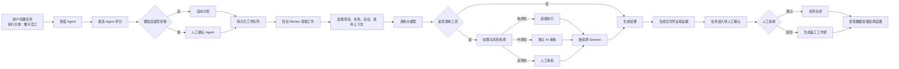

## 撒豆成兵项目Agent介绍

这个项目里的 Agent，不是“套了聊天框的大模型”，而是一套嵌入项目管理系统的、可调度、可执行、可审批、可验收、可追溯的任务型 Agent 运行平台。

产品思路可以概括成：

> 用户只负责说明要做什么，系统负责选择谁来做、提供必要上下文、控制风险、记录过程，并把结果交回给人验收。

## 整体运行原理



### 1. 用户不再选择具体 Agent

用户创建任务时，只需要把“执行主体”选成“数字员工”。

服务端会主动清除客户端可能提交的具体 Agent ID，防止绕过调度器。

“Agent 中心”仍然保留手工选择 Agent 的入口，但它主要用于：

- 开发调试
- 隔离测试
- 专项分析
- 多轮对话

正式业务入口推荐始终走“创建任务 → 自动调度”。

### 2. 调度 Agent 怎么选人

调度 Agent 在产品上是一名数字员工，但实际决策采用确定性 C# 评分，而不是把派单权直接交给大模型。

候选评分总计 100 分：

| 维度                 | 上限 |
| -------------------- | ---- |
| 能力与任务关键词匹配 | 45   |
| 当前项目资料权限     | 15   |
| 风险处理能力         | 15   |
| 当前工作负载         | 10   |
| 历史表现             | 15   |

历史表现取最近 180 天，并且：

- 越新的反馈权重越高。
- 当前项目的反馈权重更高。
- 人工验收通过是强正反馈。
- 人工驳回是强负反馈。
- 人工改选其他 Agent 也会形成反馈。

第一名综合分达到 60，置信度达到 72%，才会自动派单；否则进入“等待确认 Agent 派单”。

### 3. Agent 怎么执行任务

派单后不会在网页请求里同步执行，而是产生数据库工作项 `AgentWorkItem`。

后台 Worker 会自动：

- 领取工作项
- 把任务改成“Agent执行中”
- 创建或继续 `AiSession`
- 加载授权上下文
- 调用模型
- 处理工具调用
- 等待审批或继续下一轮
- 失败自动重试
- 最终生成正式交付

默认支持 4 个并发 Worker。队列有数据库抢占、幂等键、失败重试和超时锁恢复，应用重启后任务不会凭空消失。

任务状态会自动变化：

```
等待派单
→ Agent待执行
→ Agent执行中
→ 等待审批 / 等待重试
→ 待人工确认
→ 已确认完成
```

所以 Agent 执行完以后，状态会自动修改，但不会擅自把业务任务直接认定为最终完成。最终完成需要人工验收。

### 4. Agent 能看到什么

每个 Agent 可以单独配置上下文来源：

- 项目基本信息
- 项目任务
- 当前任务和子任务
- 任务评论
- 会议纪要
- 项目资料
- 日报、周报、月报
- 历史交付证据与会议承诺

系统先验证当前用户是否有项目访问权限，再验证当前 Agent 是否有对应资料分类的读取权限。

当前知识库已经支持：

- PDF
- Word
- PowerPoint
- Excel
- Markdown、JSON、CSV、TXT 等文本格式

文件会在后台解析、分块并按权限检索。核心逻辑在。

### 5. Agent 能调用什么工具

目前有 7 个正式业务工具：

| 工具                     | 通俗解释                      | 示例                                         | 风险控制             |
| ------------------------ | ----------------------------- | -------------------------------------------- | -------------------- |
| `task.add_comment`       | 给当前任务添加一条 Agent 评论 | “把风险分析写到任务评论里”                   | 低风险，可直接执行   |
| `task.create`            | 在当前项目中新建任务          | “根据方案创建三个后续任务”                   | 中风险，独立 AI 审核 |
| `meeting.action.create`  | 给会议纪要创建行动项          | “把会议中确定的登录优化工作登记为行动项”     | 中风险，独立 AI 审核 |
| `report.create`          | 创建日报、周报或月报          | “根据本周任务进度生成周报”                   | 中风险，独立 AI 审核 |
| `task.update`            | 修改已有任务                  | “把任务改为进行中”“更换负责人”“修改截止时间” | 高风险，人工审批     |
| `project.document.write` | 创建或更新项目资料            | “把技术方案保存到项目资料库”                 | 高风险，人工审批     |
| `project.update`         | 修改项目本身的信息            | “修改项目目标、说明、名称或状态”             | 高风险，人工审批     |

这里的“工具”，可以理解成 Agent 操作你这个项目管理系统的受控接口。

大模型负责理解需求、决定是否申请调用；真正修改数据库的是后端工具代码。Agent 不能随便操作系统，只能使用管理员明确授权的这些工具。

这些工具不是“给大模型数据库权限”，而是把 Agent 的行为限制在几个可审计的按钮里：

> 大模型只能申请按按钮，服务端决定按钮是否存在、Agent有没有资格按、是否需要审批，以及最终能不能执行。

因此，即使模型伪造任务 ID、尝试跨项目修改，或者要求绕过审批，服务端也会拒绝。

模型使用原生 Function Calling 发起工具调用，同时保留旧版 `<agent-actions>` 协议兼容。

但模型提出调用，不代表一定能执行。服务端还会重新检查：

- Agent 是否拥有该工具
- 用户是否有项目权限
- 目标任务是否属于当前 Session
- 资料分类是否有写权限
- 参数是否合法
- 风险等级是否要求审批
- 幂等键是否已经执行过

### 6. 审批和安全机制

项目采用“三档风险”：

- 低风险：直接执行
- 中风险：独立 AI 审核，不确定时自动转人工
- 高风险：必须人工审批

高风险操作在批准前不会写入业务数据。审批时还会重新检查范围、权限和数据状态。

同时具备：

- 审批事务
- 并发抢占，避免两人重复执行
- SHA-256 内容哈希
- HMAC 防篡改签名
- 非管理员不能批准自己发起的高风险操作
- 项目级权限
- Session 任务边界
- 工具调用审计
- 全站默认登录保护
- 登录限流和账户锁定

风险策略见 。

### 7. 什么叫“交付完成”

Agent 调用成功只代表模型和工具链跑通，不代表业务结果合格。

执行结束后，系统会生成 `AgentDeliveryReceipt`，包含：

- Agent 版本
- 结果结论
- 实际读取的系统证据
- 实际执行的工具影响
- 失败、拒绝和未决操作
- 风险摘要
- 内容哈希和签名
- 证据质量

然后任务进入“待人工确认”。

人工通过后任务才正式完成；人工驳回后自动生成返工工作项，并把验收结果写入 Agent 的历史表现。

对应实现见。

------

## 开发过程

### 第一阶段：从 AI 功能变成统一 Session

最开始解决的是模型调用分散的问题。

建立：

- `AgentDefinition`
- `AiSession`
- `AiSessionMessage`
- Agent 注册中心
- 统一的模型调用入口

此时 Agent 主要还是“可以持续对话的 AI”。

### 第二阶段：让 Agent 接触真实业务

加入项目、任务、会议、资料上下文，以及工具调用能力。

这里最重要的设计是：

> 大模型负责提出意图，服务端负责判断这个意图能不能执行。

从这一阶段开始，Agent 才真正从“回答问题”变成“参与工作”。

### 第三阶段：从同步调用升级为后台任务

加入持久化工作队列、重试、锁恢复、幂等和 Session 续跑。

解决了：

- 网页请求超时
- 应用重启后任务丢失
- 重复执行
- 审批以后无法继续
- Agent 一直停在“待执行”

### 第四阶段：加入调度 Agent

把“用户选择数字员工”改成“用户只创建任务”。

调度器综合能力、项目资料权限、风险、负载和历史表现评分；低置信度才让人确认。

这一阶段完成了用户体验上的核心转变：

> 用户面对的是任务，不再面对一堆模型和 Agent 名称。

### 第五阶段：加入发布和版本治理

Agent 不再是数据库里随便改的一段提示词，而是有完整生命周期：

```
草稿 → 隔离测试 → 发布 → 灰度 → 晋级/停止灰度 → 回滚
```

每次运行绑定不可变版本，旧 Session 不会因为管理员修改提示词而漂移。

### 第六阶段：加入交付、验收和反馈闭环

把“模型回答成功”与“业务验收通过”彻底分离。

人工验收数据会回流到调度器，这使调度器逐渐形成基于真实业务结果的选择偏好，而不是只看模型调用有没有报错。

### 第七阶段：生产化治理

最后补上：

- 统一待办
- 审批中心
- 执行中心
- Agent 指标
- 健康检查
- 遥测
- 数据留存
- HMAC 签名
- 会议行动项督办
- 自动化验收脚本

目前 Release 测试结果是 138/138 通过。